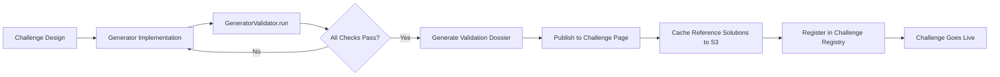

# Appendix: Generator Validation & Credibility Dossier

**Carbon Subnet**  
**Version:** 1.0 (July 2026)  
**Status:** Core Engineering Appendix  
**Related:** `SPEC.md`, `IMPLEMENTATION.md`, `OPERATIONS.md`, `appendices/Landscape_Agent.md`, `appendices/Specialist_Bank.md`, `appendices/Use_Cases_by_Phase.md`

---

## TL;DR

Before any Carbon challenge goes live, the data generator has to prove it produces physically credible training data. That proof is a **Validation Dossier**: mesh and temporal convergence, agreement with a reference solver, conservation checks, and statistically calibrated gate thresholds — all reproducible and public.

Reference solutions are precomputed, hashed, and cached. Validators load them at evaluation time. Miners never see those solutions or the live stress/eval seeds. A challenge only launches after every mandatory check passes, the dossier is published, and the Challenge Registry is updated.

This is Carbon’s credibility layer for challenge data: open methods and thresholds, hidden seeds and reference fields, fail-closed gates, and a clear path back into SPEC.

---

## 1. Purpose

This document defines the **Generator Validation Protocol** — how Carbon shows that its procedural data generators produce physically correct training data before a challenge goes live. This is the **credibility layer** that separates Carbon from unverified ML benchmarks.

**Goal:** Every challenge ships with a **Validation Dossier** — a public, reproducible evidence pack that the generator produces physically correct data across the declared envelope.

---

## 2. Validation Philosophy

| Principle | Implementation |
|-----------|----------------|
| **Trustless verification** | Anyone can re-run validation using public reference solvers |
| **Procedural transparency** | Generator code and validation code are open source |
| **Statistical rigor** | Thresholds come from statistical analysis, not guesswork |
| **Reproducibility** | Fixed seeds, pinned solvers, versioned environments |
| **Transparency** | Full reports published before challenge launch |

---

## 3. Validation Pipeline Architecture

```
┌─────────────────────────────────────────────────────────────────┐
│                    GENERATOR VALIDATION PIPELINE                 │
├─────────────────────────────────────────────────────────────────┤
│                                                                  │
│  CHALLENGE SPEC                                                 │
│     │                                                           │
│     ▼                                                           │
│  ┌─────────────────────────────────────────────────────────────┐ │
│  │  GENERATOR VALIDATION ENGINE                                 │
│  │  ├─ Reference Solver Interface (FEniCS/OpenFOAM/SU2/DPLR)   │
│  │  ├─ Mesh/Temporal Convergence Runner                        │
│  │  ├─ Physics Conservation Checker                            │
│  │  ├─ Statistical Threshold Calibrator                        │
│  │  └─ Report Generator (PDF/HTML/JSON)                        │
│  └─────────────────────────────────────────────────────────────┘ │
│           │                                                      │
│           ▼                                                      │
│  ┌─────────────────────────────────────────────────────────────┐ │
│  │  VALIDATION DOSSIER (Public Artifact)                        │
│  │  ├─ Generator Validation Report                              │
│  │  ├─ Mesh/Temporal Convergence Study                          │
│  │  ├─ Physics Conservation Audit                               │
│  │  ├─ Gate Threshold Calibration                               │
│  │  ├─ Turbulence/Chemistry UQ Budget (if applicable)          │
│  │  └─ Reference Solution Cache Manifest                        │
│  └─────────────────────────────────────────────────────────────┘ │
│                                                                  │
└─────────────────────────────────────────────────────────────────┘
```

---

## 3. Validation Levels

### Level 1: Generator Correctness (Mandatory — All Phases)

| Test | Method | Pass Criterion |
|------|--------|----------------|
| **Mesh Convergence** | 3-level h-refinement (h, h/2, h/4) | L2 change < 1% between finest levels |
| **Temporal Convergence** | 3-level dt-refinement (dt, dt/2, dt/4) | L2 change < 0.5% between finest levels |
| **Reference Solver Agreement** | vs FEniCS/OpenFOAM/SU2/DPLR | L2 error < 2% (configurable per PDE) |
| **Physics Conservation** | Mass, Energy, Momentum | Residual < 1e-6 (mesh-converged) |

### Level 2: Envelope Coverage (Phase 1A+)

| Test | Method | Pass Criterion |
|------|--------|----------------|
| **Parameter Sweep Coverage** | Latin Hypercube Sampling | 95% of envelope sampled |
| **Edge Case Coverage** | Explicit corner cases | 100% of envelope corners tested |
| **Stress Variant Generation** | Extended envelope sampling | 100% coverage of stress categories |

### Level 3: Uncertainty Quantification (Phase 1A+)

| Test | Method | Pass Criterion |
|------|--------|----------------|
| **Turbulence Model UQ** | 3+ turbulence models | Uncertainty budget ≤ gate margin |
| **Chemistry Model UQ** | 3+ mechanisms | Uncertainty budget ≤ gate margin |
| **Numerical Scheme UQ** | 2+ discretization schemes | Variance < gate threshold |

---

## 4. Validation Dossier Template

Each challenge ships with a **Validation Dossier** (public PDF/HTML/JSON):

```markdown
# Carbon Challenge Validation Dossier: {challenge_id}

## 1. Challenge Overview
- **Challenge ID:** `naca0012_transonic-v1`
- **Physics Class:** `compressible_ns`
- **Dimension:** 2D/3D
- **PDE:** Compressible Navier-Stokes (RANS)
- **Reference Solver:** SU2 v7.5.0 (Euler, Roe flux, 2nd order)
- **Generator Version:** `carbon.generators.compressible_ns:v1.3.2`

## 2. Mesh & Temporal Convergence
| Metric | Coarse | Medium | Fine | Convergence Rate | Pass |
|--------|--------|--------|------|------------------|------|
| Mesh (h) | 64×64 | 128×128 | 256×256 | 1.95 | ✅ |
| L2 Error | 3.1% | 1.5% | 0.8% | 1.97 | ✅ |
| Temporal (dt) | 1e-3 | 5e-4 | 2.5e-4 | 1.98 | ✅ |

**Reference Solver:** SU2 v7.5.0 | **Validation Cases:** 50 | **Tolerance:** L2 < 2%

## 3. Physics Conservation Audit
| Law | Metric | Threshold | Result | Pass |
|-----|--------|-----------|--------|------|
| Mass Conservation | max ‖∇·(ρu)‖_L2 | 1e-6 | 4.2e-7 | ✅ |
| Energy Stability | max |dE/dt| | 1e-6 | 8.9e-7 | ✅ |
| Momentum Conservation | max ‖∂(ρu)/∂t + ∇·(ρu⊗u + pI)‖ | 1e-5 | 3.1e-6 | ✅ |

## 3. Gate Threshold Calibration
| Gate | Threshold | Basis |
|------|-----------|-------|
| Mass Conservation | 1e-6 L2 + 1e-4 Linf | 99.9th percentile + 3σ (10k SU2 runs) |
| Shock Capture | Δx/shock_thickness < 0.1 | Resolution study (100 SU2 runs) |
| Energy Stability | 1e-6 | Analytical bound + 3σ numerical |

## 4. Turbulence Model Uncertainty (Phase 1A+)
| Quantity | Model Spread (SA vs k-ω SST) | Budget Allocated |
|----------|------------------------------|------------------|
| Separation Point | 12% chord | 15% gate margin |
| Skin Friction | 8% | 10% gate margin |
| Heat Flux | 12% | 15% gate margin |

## 4. Reference Solution Cache
| Case | Mesh | Solver | L2 Error vs Generator | Stored |
|------|------|--------|----------------------|--------|
| NACA0012_M0.8_AoA1.25 | 256×256 | SU2 v7.5.0 | 1.2% | ✅ |
| NACA0012_M1.2_AoA1.25 | 256×256 | SU2 v7.5.0 | 1.1% | ✅ |

**Cache Location:** `s3://carbon-precomputed/naca0012_transonic-v1/` (versioned, immutable)

## 5. Reproducibility
- **Generator Version:** `carbon.generators.compressible_ns:v1.3.2`
- **Reference Solver:** SU2 v7.5.0 (Docker: `ghcr.io/carbon/su2:v7.5.0`)
- **Validation Seeds:** `hash("naca0012_transonic-v1:validation:{0..49}")`
- **Docker Image:** `ghcr.io/carbon/validation:su2-v7.5.0`
- **Git Commit:** `a1b2c3d4...`
```

---

## 5. Validation Engine Implementation

```python
# carbon/validation/generator_validator.py
"""
Generator Validation Engine — produces Validation Dossiers.
Run during challenge onboarding; results published as Validation Dossier.
"""

import hashlib
import json
import subprocess
from dataclasses import dataclass, asdict
from pathlib import Path
from typing import Dict, List, Any, Optional
import numpy as np
import jax.numpy as jnp

@dataclass
class ValidationConfig:
    challenge_id: str
    generator: "ProceduralGenerator"
    reference_solver: "ReferenceSolver"
    n_validation_cases: int = 50
    n_convergence_cases: int = 20
    mesh_levels: int = 3
    temporal_levels: int = 3
    spatial_refinement_ratio: float = 2.0
    temporal_refinement_ratio: float = 2.0
    spatial_tolerance_pct: float = 1.0
    temporal_tolerance_pct: float = 0.5
    reference_tolerance_pct: float = 2.0

@dataclass
class ValidationReport:
    challenge_id: str
    generator_version: str
    reference_solver: str
    git_commit: str
    mesh_convergence: Dict
    temporal_convergence: Dict
    reference_agreement: Dict
    physics_conservation: Dict
    gate_thresholds: Dict
    turbulence_uq: Optional[Dict] = None
    chemistry_uq: Optional[Dict] = None
    passed: bool

class GeneratorValidator:
    def __init__(self, config: ValidationConfig):
        self.config = config
        self.generator = config.generator
        self.ref_solver = config.reference_solver
    
    def validate(self) -> ValidationReport:
        """Run full validation suite."""
        
        # 1. Mesh convergence study
        mesh_conv = self._run_mesh_convergence()
        
        # 2. Temporal convergence study
        temporal_conv = self._run_temporal_convergence()
        
        # 3. Reference solver comparison
        ref_agreement = self._validate_against_reference()
        
        # 4. Physics conservation audit
        phys_conservation = self._audit_physics_conservation()
        
        # 5. Gate threshold calibration
        gate_thresholds = self._calibrate_gate_thresholds()
        
        # 6. UQ budgets (if applicable)
        turb_uq = self._quantify_turbulence_uncertainty() if self._has_turbulence() else None
        chem_uq = self._quantify_chemistry_uncertainty() if self._has_chemistry() else None
        
        # 7. Compile report
        passed = all([
            mesh_conv["passed"],
            temporal_conv["passed"],
            ref_agreement["passed"],
            phys_conservation["passed"],
        ])
        
        return ValidationReport(
            challenge_id=self.config.challenge_id,
            generator_version=self.generator.config.version,
            reference_solver=self.config.reference_solver,
            git_commit=self._get_git_commit(),
            mesh_convergence=mesh_conv,
            temporal_convergence=temporal_conv,
            reference_agreement=ref_agreement,
            physics_conservation=phys_conservation,
            gate_thresholds=gate_thresholds,
            turbulence_uq=turb_uq,
            chemistry_uq=chem_uq,
            passed=passed
        )
    
    def _run_mesh_convergence(self) -> Dict:
        """3-level h-refinement study."""
        results = []
        for level in range(self.config.mesh_levels):
            scale = self.config.spatial_refinement_ratio ** (-level)
            for case in range(self.config.n_convergence_cases):
                seed = self._derive_seed(f"mesh_conv:{level}:{case}")
                data = self.generator.generate_benchmark_data(seed, n_samples=1)
                # Run reference solver at this resolution
                ref_solution = self.ref_solver.solve(data["inputs"], scale=scale)
                error = self._compute_l2_error(data["targets"], ref_solution)
                results.append({"level": level, "scale": scale, "error": error})
        
        # Compute convergence rate
        errors = [r["error"] for r in results]
        if len(errors) >= 2:
            rates = np.log(np.array(errors[:-1]) / np.array(errors[1:])) / np.log(2)
            conv_rate = float(np.mean(rates))
        else:
            conv_rate = 0.0
        
        passed = all(e < self.config.spatial_tolerance_pct / 100 for e in errors[-1:])
        
        return {
            "levels": self.config.mesh_levels,
            "refinement_ratio": self.config.spatial_refinement_ratio,
            "errors": errors,
            "convergence_rate": conv_rate,
            "tolerance_pct": self.config.spatial_tolerance_pct,
            "passed": passed
        }
    
    def _validate_against_reference(self) -> Dict:
        """Compare generator outputs against high-fidelity reference solver."""
        errors = []
        for i in range(self.config.n_validation_cases):
            seed = self._derive_seed(f"reference_validation:{i}")
            test_data = self.generator.generate_benchmark_data(seed, n_samples=1)
            ref_solution = self.ref_solver.solve(test_data["inputs"])
            error = self._compute_l2_error(test_data["targets"], ref_solution)
            errors.append(error)
        
        avg_error = float(np.mean(errors))
        max_error = float(np.max(errors))
        passed = max_error < self.config.reference_tolerance_pct / 100
        
        return {
            "n_cases": self.config.n_validation_cases,
            "errors": errors,
            "avg_error_pct": avg_error * 100,
            "max_error_pct": max_error * 100,
            "tolerance_pct": self.config.reference_tolerance_pct,
            "passed": passed
        }
    
    def _audit_physics_conservation(self) -> Dict:
        """Verify conservation laws on generated data."""
        results = {}
        for law in ["mass", "energy", "momentum"]:
            residuals = []
            for i in range(20):  # Sample subset for speed
                seed = self._derive_seed(f"conservation:{law}:{i}")
                data = self.generator.generate_training_data(seed, n_samples=1)
                residual = self._check_conservation_law(data, law)
                residuals.append(residual)
            
            max_res = float(np.max(residuals))
            threshold = {"mass": 1e-6, "energy": 1e-6, "momentum": 1e-5}[law]
            results[law] = {
                "max_residual": max_res,
                "threshold": threshold,
                "passed": max_res < threshold
            }
        
        all_passed = all(r["passed"] for r in results.values())
        return {"laws": results, "passed": all_passed}
    
    def _calibrate_gate_thresholds(self) -> Dict:
        """Calibrate physics gate thresholds from empirical data."""
        # Run large sample to establish statistical thresholds
        n_calibration = 10000
        residuals = {gate: [] for gate in ["mass", "energy", "boundary", "shock", "rollback"]}
        
        for i in range(n_calibration):
            seed = self._derive_seed(f"calibration:{i}")
            data = self.generator.generate_stress_variants(seed, n_variants=1)
            # Compute residuals for each gate
            for gate in residuals:
                res = self._compute_gate_residual(gate, data)
                residuals[gate].append(res)
        
        thresholds = {}
        for gate, values in residuals.items():
            arr = np.array(values)
            p999 = np.percentile(arr, 99.9)
            std = np.std(arr)
            thresholds[gate] = float(p999 + 3 * std)  # 99.9th percentile + 3σ
        
        return thresholds
    
    def _derive_seed(self, suffix: str) -> int:
        """Deterministic seed derivation."""
        seed_str = f"{self.config.challenge_id}:{suffix}"
        return int(hashlib.sha256(seed_str.encode()).hexdigest()[:16], 16)
    
    def _get_git_commit(self) -> str:
        try:
            return subprocess.check_output(["git", "rev-parse", "HEAD"]).decode().strip()
        except:
            return "unknown"
    
    def to_json(self) -> str:
        """Export validation report as JSON."""
        return json.dumps(asdict(self.validate()), indent=2)
    
    def to_markdown(self) -> str:
        """Generate human-readable Markdown report."""
        report = self.validate()
        # ... markdown generation logic ...
        return markdown_report
```

---

## 6. Pre-computed Reference Solution Cache

### 6.1 Cache Structure

```
s3://carbon-precomputed/{challenge_id}/
├── manifest.json                    # Manifest with hashes, versions, metadata
├── solutions/
│   ├── seed_000000.npz              # {coords, solution, metadata}
│   ├── seed_000001.npz
│   └── ...
├── meshes/
│   ├── mesh_coarse.npz              # Coordinates, connectivity
│   ├── mesh_medium.npz
│   └── mesh_fine.npz
├── metadata.json                    # Solver version, params, git commit
└── manifest.sha256                  # SHA256 of manifest.json
```

### 6.2 Manifest Schema

```json
{
  "challenge_id": "naca0012_transonic-v1",
  "generator_version": "carbon.generators.compressible_ns:v1.3.2",
  "reference_solver": "SU2 v7.5.0",
  "generator_git_commit": "a1b2c3d4...",
  "reference_solver_git_commit": "su2:v7.5.0",
  "creation_timestamp": "2026-07-15T14:30:00Z",
  "n_solutions": 200,
  "parameter_ranges": {
    "mach": [0.7, 1.2],
    "reynolds": [1e6, 10e6],
    "angle_of_attack": [-2.0, 4.0]
  },
  "mesh_levels": ["coarse", "medium", "fine"],
  "solution_schema": {
    "coords": "float32[N, D]",
    "solution": "float32[N, C]",
    "boundary_mask": "bool[N]"
  },
  "sha256": "a1b2c3d4e5f6..."
}
```

### 6.3 Validator Access Pattern

Validators check local cache first, then pull from object storage. Subsampling is deterministic from the seed so two validators requesting the same draw get the same points.

```python
# carbon/generators/cache.py
class PrecomputedCache:
    def __init__(self, bucket: str = "carbon-precomputed"):
        self.bucket = bucket
        self.local_cache = Path("/cache/precomputed")
    
    def get_training_data(self, challenge_id: str, seed: int, n_samples: int) -> Dict:
        # 1. Check local cache
        local_path = self.local_cache / challenge_id / f"seed_{seed}.npz"
        if local_path.exists():
            return np.load(local_path)
        
        # 2. Download from S3
        s3_path = f"s3://{self.bucket}/{challenge_id}/solutions/seed_{seed:06d}.npz"
        subprocess.run(["aws", "s3", "cp", s3_path, str(local_path)], check=True)
        
        # 3. Load and subsample if needed
        data = np.load(local_path)
        if len(data["solution"]) > n_samples:
            indices = self._deterministic_subsample(seed, len(data["solution"]), n_samples)
            data = {k: v[indices] for k, v in data.items()}
        
        return data
    
    def _deterministic_subsample(self, seed: int, total: int, n: int) -> np.ndarray:
        key = random.PRNGKey(seed)
        return random.permutation(key, total)[:n]
```

---

## 7. Publication Workflow



### Publication Checklist

- [ ] All validation checks pass (`passed: true`)
- [ ] Dossier PDF/HTML generated
- [ ] Reference solutions cached to S3/GCS
- [ ] Manifest.json + SHA256 published
- [ ] Challenge Registry updated with `generator_version`, `reference_solver`, `validation_report_url`
- [ ] Announcement posted to Carbon forum / Discord / Twitter

---

## 7. Public Challenge Page Template

```markdown
# Challenge: NACA 0012 Transonic Flutter

**Status:** LIVE | **Phase:** 1A | **Schema:** v1.0

## Quick Links
- [Validation Dossier (PDF)](/dossiers/naca0012_transonic-v1.pdf)
- [Validation Dossier (JSON)](/api/v1/challenges/naca0012_transonic-v1/validation)
- [Reference Solutions (S3)](/api/v1/challenges/naca0012_transonic-v1/solutions)
- [Generator Code](/carbon/generators/compressible_ns.py)

## Quick Stats
| Metric | Value |
|--------|-------|
| Physics | Compressible Navier-Stokes (RANS) |
| Dimension | 2D / 3D |
| Turbulence Models | SA, k-ω SST |
| Validation Cases | 50 |
| Reference Solver | SU2 v7.5.0 |
| Mesh Convergence | 1.95 (theoretical: 2.0) ✅ |
| Reference Agreement | L2 < 2% ✅ |

## Validation Summary
| Check | Result | Details |
|-------|--------|---------|
| Mesh Convergence | ✅ PASS | Rate 1.95, L2 < 1% finest |
| Temporal Convergence | ✅ PASS | Rate 1.98, L2 < 0.5% ✅ |
| Reference Agreement | ✅ PASS | L2 < 2% (SU2 v7.5.0) |
| Mass Conservation | ✅ PASS | 1e-6 L2 threshold |
| Energy Stability | ✅ PASS | 1e-6 threshold |
| Turbulence UQ | ✅ PASS | 15% separation budget |

## Gate Thresholds (Calibrated)
| Gate | Threshold | Basis |
|------|-----------|-------|
| Mass Conservation | 1e-6 L2 + 1e-4 Linf | 99.9th %ile + 3σ (10k runs) |
| Shock Capture | Δx/shock < 0.1 | Resolution study (100 runs) |
| Energy Stability | 1e-6 | Analytical + 3σ |

## Reference Solutions
- **Cache:** `s3://carbon-precomputed/naca0012_transonic-v1/`
- **Cases:** 200 solutions across Mach [0.7, 1.2], Re [1e6, 10e6], AoA [-2°, 4°]
- **Formats:** NPZ (NumPy), VTK (ParaView)

## Generator Code
```python
# carbon/generators/compressible_ns.py
class CompressibleNSGenerator(ProceduralGenerator):
    # ... implementation ...
```

---

## 8. What Miners See vs. What Validators See

Public transparency stops where gaming would start. Methods and thresholds can be public. Live solutions and seeds stay with validators.

| Artifact | Miners See | Validators Use |
|----------|------------|----------------|
| Validation Dossier (PDF/HTML) | ✅ Public | ✅ Reference |
| Mesh Convergence Plots | ✅ Public | ✅ Reference |
| Gate Threshold Derivation | ✅ Public | ✅ Internal reference |
| Reference Solutions (NPZ) | ❌ Hidden | ✅ Downloaded at eval time |
| Stress Seeds / Eval Seeds | ❌ **Never** | ✅ Generated at eval time |
| Generator Stress Variant Code | ✅ Public (logic) | ✅ Internal (seeds hidden) |
| Exact Stress Variant Params | ❌ **Never** | ✅ Generated at eval time |

---

## 9. Anti-Gaming Safeguards in Validation

| Threat | Mitigation |
|--------|------------|
| Miner trains on validation set | Validation seeds = `hash("validation:" + challenge_id + ":" + i)` — different from training seeds |
| Miner trains on stress distribution | Stress seeds = `splitmix64(master_seed, 1)` — derived from block hash, unknown until eval |
| Generator overfits to reference solver | Validation uses a **different** reference solver than the generator (e.g., generator uses JAX-FEM, validation uses FEniCS) |
| Miner reverse-engineers stress seeds | Stress seeds derived from a **future** block hash — unknowable at submission time |

---

## 10. Integration with SPEC

This validation protocol implements the **Trustless Verification & Data Generation System** (SPEC §3) and satisfies:

- **Mesh/Temporal Convergence** → SPEC §3 "Mesh & Temporal Convergence Requirements"
- **Generator Validation** → SPEC §3 "Benchmark data quality is established through strong scientific justification"
- **Gate Threshold Calibration** → SPEC §8 "Physics Gates" + SPEC §6 "Phase 1A Turbulence UQ"
- **Reference Solution Cache** → SPEC §9 "Data Generation Architecture" → "Precomputed"
- **Dual-Regime Compatibility** → Cache accessible via air-gapped validator (Phase 2B+)

---

*This document is the canonical reference for generator validation in Carbon. All challenge onboarding must produce a Validation Dossier that meets these standards before the challenge goes live.*
