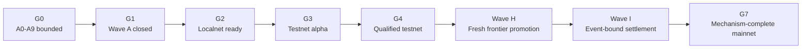

# Carbon Testnet-to-Mainnet Launch Path

**Executable roadmap mapped to Carbon Waves A-I**

**Status:** Working control document; not launch approval

**Version:** 1.0

**Date:** 25 August 2026

**Repository baseline:** main @ f308281e69580216d5ebf5ec94a9d6c069cf1a56

**Planning assumption:** Recent Codex implementation pace, one independent review lane, timely human decisions

> [!IMPORTANT]
> This file is an operational planning and execution view. It does not authorize implementation, scientific qualification, security acceptance, settlement, chain action, or launch. [`CONSTITUTION.md`](../CONSTITUTION.md), [`.agent/WAVE.md`](../.agent/WAVE.md), [`Design_Specs/Build_Out.md`](../Design_Specs/Build_Out.md), [`Design_Specs/Build_Out_Constitutional_Overlay.md`](../Design_Specs/Build_Out_Constitutional_Overlay.md), [`Design_Specs/Launch_Bar.md`](../Design_Specs/Launch_Bar.md), and [`docs/context/MASTER_OPEN_DESIGN_QUESTIONS.md`](../docs/context/MASTER_OPEN_DESIGN_QUESTIONS.md) remain controlling.

> **Recommended launch definition:** Treat a qualified one-Challenge testnet as the P0 proof, and treat Waves H and I as required before Carbon calls mainnet mechanism-complete. A direct score-to-weight mainnet can exist only as a separately authorized, restricted beta; it is not the incentive mechanism described in Carbon's current public architecture.

**Current position**

**A0-A9 are implemented and tested only in their bounded fixture/control scopes. Carbon has not yet earned scientific, security, network, or production qualification.**

# 1. Executive launch decision

Carbon should manage launch as an evidence-gated program, not as a date-driven deployment. The first credible public milestone is a qualified one-Challenge testnet. The recommended economic launch is a mechanism-complete mainnet in which common fresh evidence creates a FrontierAdvanceEvent and a separate treasury path settles the resulting obligation.

> **Why this matters:** The repository can reach a Bittensor weight-write demo faster than it can earn the right to create scientific and economic winners. Keeping those milestones separate prevents transport progress from being mistaken for a trusted incentive mechanism.

| **Milestone**                  | **Planning window**                    | **Confidence** | **What must be true**                                          |
|--------------------------------|----------------------------------------|----------------|----------------------------------------------------------------|
| **Wave A closed**              | 31 Aug-3 Sep 2026                      | High           | A10-A12 and closeout report                                    |
| **Localnet ready**             | 11-18 Sep 2026                         | Medium-high    | v11 adapter, signed HTTP, state recovery, test-only weights    |
| **Testnet alpha**              | 30 Sep-16 Oct 2026                     | Medium         | real reconstruction/evaluation path; explicitly non-LIVE       |
| **Qualified testnet**          | 19 Oct-6 Nov 2026                      | Medium-low     | Wave D Burgers evidence, security gate, soak                   |
| **Mainnet decision gate**      | 4 Dec 2026                             | Medium         | choose restricted beta or mechanism-complete-only path         |
| **Mechanism-complete mainnet** | Target 12 Feb 2027; contingency 12 Mar | Low-medium     | Waves H/I, custody, settlement soak, external chain conditions |

These are planning windows, not launch promises. Root-controlled emission enablement, dynamic registration cost, chain activation timing, science reruns, security acceptance, and human custody actions are outside coding throughput.

## Decision required now

- Ratify fixed-viscosity Burgers v1 as the first authoritative Challenge direction (MQ-001).

- Ratify the launch-state taxonomy and whether a direct-weight mainnet beta is permitted (proposed MQ-052).

- Authorize Waves H and I to become the launch-critical branch after Wave D while Waves E-G remain parallel/deferred (proposed MQ-053).

- Name the human authority and key roles required by MQ-018. Role labels are assigned in this plan, but no launch-critical human task is executable until a person is named.

# Document map

- 1\. Executive launch decision

- 2\. Launch states and gate definitions

- 3\. Repository baseline and Wave analysis

- 4\. Critical path, dates, and workload

- 5\. Ownership and execution model

- 6\. Detailed launch task register

- 7\. Master Open Questions closure register

- 8\. Risks, stop-ship rules, and operating cadence

- 9\. Evidence and source basis

# 2. Launch states and gate definitions

The same word cannot safely describe a process-local test, a testnet deployment, and an economic production launch. Carbon should use the following gate names in the repository, dashboards, investor materials, and operator runbooks.

| **Gate** | **Name**                   | **State**      | **Pass condition**                                                                                                 | **Claim boundary**                                         |
|----------|----------------------------|----------------|--------------------------------------------------------------------------------------------------------------------|------------------------------------------------------------|
| **G0**   | CURRENT                    | PASS (bounded) | A0-A9 fixture/control foundation at the audited commit.                                                            | No real evaluator, network, or winner.                     |
| **G1**   | WAVE_A_CLOSED              | NOT REVIEWED   | A10-A12 complete; Wave-A Closeout Report signed.                                                                   | Still no science or network qualification.                 |
| **G2**   | LOCALNET_READY             | NOT REVIEWED   | Bittensor v11 chain adapter, authenticated transport, durable state, localnet E2E, test-only weight capability.    | No fixture result presented as scientific evidence.        |
| **G3**   | TESTNET_ALPHA              | NOT REVIEWED   | Real declarative reconstruction, sandbox, reference, measurements, receipts, score-to-weight transport on testnet. | Explicit NON-LIVE / NON-SETTLING.                          |
| **G4**   | QUALIFIED_TESTNET          | NOT REVIEWED   | Exact Burgers Challenge passes Wave D, security gate, independent review, and soak.                                | P0 complete; no frontier settlement yet.                   |
| **G5**   | MAINNET_DEPLOYABLE         | NOT REVIEWED   | Keys, custody, infrastructure, validators, runbooks, budget, release freeze and go/no-go ready.                    | Economic activation may remain off.                        |
| **G6**   | MAINNET_BETA               | OPTIONAL       | Restricted, expressly authorized direct-weight beta with capped claims and risk controls.                          | Not mechanism-complete; do not use as the public IM proof. |
| **G7**   | MAINNET_MECHANISM_COMPLETE | NOT REVIEWED   | Wave H superiority event plus Wave I event-bound settlement are qualified; mainnet activation record complete.     | Recommended public mainnet target.                         |

## Non-negotiable launch rules

- Fixture isolation: A5/A8 fixture results never authorize even testnet scientific weights. G2 uses a separate, visibly transport-only test capability.

- Exam before candidates: G4 cannot pass until the exact Challenge, reference, measurements, Score Pack, uncertainty floor, and backend profile have earned authority.

- Science before settlement: an ordinary leaderboard result can nominate; it cannot create a FrontierAdvanceEvent or payment.

- No silent fallback: reference, generator, reconstruction, network, or infrastructure failure never becomes a candidate physics zero and never falls back to mock truth.

- Human authority: agents implement machinery and evidence collection; humans approve science, security, economics, keys, and production actions.

# 3. Repository baseline and Wave analysis

The audited baseline is Carbon main at f308281e69580216d5ebf5ec94a9d6c069cf1a56. The repository records 1,727 CPU tests at A9 closeout. This audit did not independently re-run that suite because the review runtime did not include pytest; the status below relies on the recorded CI evidence in .agent/WAVE.md.

| **Ticket** | **State** | **Bounded maturity**                                      |
|------------|-----------|-----------------------------------------------------------|
| **A-1**    | DONE-E    | Orientation and reuse audit                               |
| **A0**     | DONE-E    | Canonical package and reserved boundaries                 |
| **A1**     | DONE-E    | CPU CI and quality ratchet                                |
| **A2**     | DONE-E    | TrainingStrategy schema and dry validation                |
| **A3**     | DONE-E    | Challenge registry and exact qualification-hash LIVE gate |
| **A4**     | DONE-E    | Seed domains, commitments, leakage boundaries             |
| **A5**     | DONE-E    | Deterministic scoring engine and fixture Score Pack       |
| **A6**     | DONE-E    | Process-local card store and public projection            |
| **A7**     | DONE-E    | Process-local submission/FSM/fee/retry/refund             |
| **A8**     | DONE-E    | Deterministic fixture-only TrainEval stub; non-emitting   |
| **A9**     | DONE-E    | Seven-tool in-process MCP control/disclosure skeleton     |
| **A10**    | IN REVIEW | Contract candidate on origin/pr36; no implementation      |
| **A11**    | TODO      | Observability, metrics, redaction, failure tags           |
| **A12**    | TODO      | Invariant CI and Wave-A closeout                          |

## What the current repository does not yet contain

- A real JAX reconstruction/TrainEval backend or qualified backend profile.

- Canonical runtime population, SamplingPlan, ReferencePolicy, TruthAsset, MeasurementContract, or production Score Pack implementations.

- A qualified Burgers exam, Validation Dossier, Incentive Alignment Dossier, or minimum resolvable improvement.

- Authenticated network transport, durable submission/evidence stores, signed EvaluationReceipts, an append-only evidence ledger, or re-execution audits.

- A qualified sandbox, production randomness beacon, validator disagreement/quarantine path, or adaptive leakage qualification.

- A Bittensor v11 chain path. carbon/chain is deferred; tracked neuron code uses obsolete APIs and bypasses A2-A9.

- A frontier-promotion layer, SettlementObligation, treasury/vault, or mechanism-complete economic path.

## Wave map and launch relevance

| **Wave** | **Canonical purpose**                    | **Treatment**    | **Launch meaning**                    |
|----------|------------------------------------------|------------------|---------------------------------------|
| **A**    | Bounded software authority skeleton      | Close now        | Required foundation; no launch claim  |
| **B**    | Science-authoring contracts              | Critical         | Makes one exam authorable             |
| **C**    | Real vertical and testnet transport      | Critical         | Creates G2/G3                         |
| **D**    | Human scientific qualification           | Critical         | Creates G4/P0                         |
| **E**    | Landscape/evidence memory                | Parallel/defer   | Not required for first launch         |
| **F**    | Product qualification/specialists        | Parallel/defer   | Not required for subnet launch        |
| **G**    | Commercial/private/sponsored plane       | Parallel/defer   | Business lane; cannot rewrite science |
| **H**    | Frontier promotion/portfolio             | Mainnet-critical | Creates verified frontier event       |
| **I**    | Treasury/network settlement              | Mainnet-critical | Settles event-bound entitlement       |
| **J-N**  | Model neutrality to Physics Intelligence | Later            | Explicitly outside first launch       |

> **Required sequencing amendment:** The current Master Plan places H/I after E-G. For a Carbon-consistent mainnet without delaying on product and commercial layers, the owner should explicitly authorize H/I as the launch-critical branch after D and allow E-G to proceed in parallel. This is a governance decision, not an engineering assumption.

## Reuse disposition

| **Disposition** | **Scope**                                                                                                                            |
|-----------------|--------------------------------------------------------------------------------------------------------------------------------------|
| **KEEP**        | A2-A9 bounded contracts, exact identity/pin rules, disclosure and infra-vs-science boundaries                                        |
| **WRAP**        | A5 scoring, A7 lifecycle, A9 MCP, Challenge registry, seeding and card projection behind production adapters                         |
| **REPAIR**      | A10-A12 dependency graph, stale maturity prose, CI, persistence, containers, K8s, observability and runbooks                         |
| **REPLACE**     | Legacy official neuron path, Axon/Dendrite/Synapse transport, hydrogen imports, placeholder client, direct legacy emission mechanics |

## Authority gaps to close before Wave B freezes

| **Classification**     | **Required action**                                                                                                                                            |
|------------------------|----------------------------------------------------------------------------------------------------------------------------------------------------------------|
| **DOCUMENTATION_LAG**  | Master Plan still shows A8/A9 as todo; main WAVE/ledger are current.                                                                                           |
| **DEPENDENCY_LAG**     | A11 and A12 omit dependencies required by their own acceptance claims; Wave-A report is missing.                                                               |
| **MIGRATION_REQUIRED** | Legacy direct score-to-emission, block-hash seed, universal Julia truth, mock fallback and obsolete neuron language conflict with the integrated constitution. |
| **NEW_OWNER_DECISION** | Launch taxonomy, H/I sequencing, network topology, weight/no-winner policy, keys/custody and validator independence are not ratified.                          |

# 4. Critical path, dates, and workload

Wave B science authoring and the Bittensor v11 foundation run in parallel before they converge in Wave C. Wave D qualification controls G4.

The network foundation and Wave B science-authoring substrate can run in parallel after their interfaces are ratified. They converge in Wave C. Wave D evidence, security acceptance, and soak then determine the qualified-testnet date. Waves H and I can be specified during testnet work, but implementation requires explicit later-wave authorization.

## Planning sprints

| **Sprint** | **Window**    | **Primary outcome**                                                |
|------------|---------------|--------------------------------------------------------------------|
| **S0**     | 25 Aug-3 Sep  | Close A10-A12; ratify launch taxonomy/RACI; reconcile authority    |
| **S1**     | 4-18 Sep      | Wave B contracts + Bittensor v11 foundation + localnet             |
| **S2**     | 21 Sep-9 Oct  | Wave C real vertical; testnet alpha target                         |
| **S3**     | 12-30 Oct     | Wave D campaigns; qualified testnet target                         |
| **S4**     | 2 Nov-4 Dec   | Qualified soak; H/I specification; mainnet decision gate           |
| **S5**     | 7 Dec-12 Feb  | H/I implementation, custody, settlement soak, mainnet readiness    |
| **BUFFER** | 15 Feb-12 Mar | Evidence reruns, security fixes, chain/external timing contingency |

## Workload evaluation

| **Workstream**              | **Primary-lane days** | **Total person-days** | **Human/ops load**                 | **Uncertainty** |
|-----------------------------|-----------------------|-----------------------|------------------------------------|-----------------|
| **Wave A closeout**         | 3-5                   | 4-7                   | 1-2 review days                    | Low             |
| **Wave B authoring**        | 8-12                  | 18-28                 | 3-7 SciML/protocol days            | Medium          |
| **v11 foundation/localnet** | 7-10                  | 15-24                 | 2-4 ops/security days              | Medium          |
| **Wave C real vertical**    | 15-25                 | 40-65                 | 5-10 SciML/security/SRE days       | High            |
| **Wave D qualification**    | 10-20 active          | 25-45 specialist      | Independent review + reruns        | Very high       |
| **Qualified testnet soak**  | 10-15 elapsed         | 10-20                 | Active monitoring                  | Medium          |
| **Wave H**                  | 10-15                 | 18-28                 | Protocol/statistics signoff        | Medium          |
| **Wave I**                  | 15-25                 | 25-40                 | Custody/security/economics         | High            |
| **Mainnet operations**      | 10-15                 | 15-25                 | Funding, keys, validator bootstrap | High            |
| **Settlement/mainnet soak** | 10-15 elapsed         | 10-20                 | Active go/no-go review             | Medium          |

Estimate model: one primary Codex implementation lane, one independent review lane, network/SciML/SRE work allowed in parallel, and blocking human decisions answered within two business days. A single serial executor or delayed scientific/security review adds roughly 30-50% calendar time. Soak time and external chain timing do not compress with more coding throughput.

# 5. Ownership and execution model

Assignments below are role-level because the repository has no named RACI. The launch owner must put a person next to each role before G1. Until then, any task requiring human accountability is BLOCKED-H even if an agent can draft its materials.

| **Role**         | **Directly owns**                                                     | **Cannot approve alone**                         |
|------------------|-----------------------------------------------------------------------|--------------------------------------------------|
| **LAUNCH**       | Dates, budget, final go/no-go, chain-action coordination              | Science, security or custody alone               |
| **TL / PL**      | Ticket contracts, Wave mapping, protocol semantics, review discipline | Scientific thresholds or production launch alone |
| **CDX**          | Bounded code, tests, documentation, evidence automation               | Any human approval or production chain action    |
| **SCI / STAT**   | Challenge, reference, measurements, uncertainty, Dossiers             | Chain/custody actions                            |
| **NET / API**    | v11 adapter, metagraph, weights, signed HTTP, submission identity     | Economic or security policy alone                |
| **VE**           | Real reconstruction/evaluation composition and receipts               | Dossier pass/fail                                |
| **SRE**          | CI, images, runtime, node, queue/store, metrics, DR/on-call           | Launch authorization                             |
| **SEC**          | Threat model, sandbox, transport, leakage, key/custody acceptance     | Science or economics                             |
| **ECON / TREAS** | Weight policy, frontier economics, obligations, custody/settlement    | Scientific merit                                 |
| **COUNSEL**      | Appeals, participant/IP, custody and claim language                   | Technical qualification                          |
| **IV / IR**      | Independent validator and scientific replication/review               | Carbon's final launch signoff                    |
| **CUSTODY**      | Multisig/proxy, registration/start-call, treasury release             | Protocol/science decisions                       |

## Minimum operating team through G4

- One Codex/engineering implementation lane and one independent code-review lane.

- One accountable protocol/tech lead with authority to ratify bounded tickets.

- A Physics/SciML lead and a statistics reviewer available during Waves B-D.

- A network/API engineer and an SRE owner from S1 through testnet soak.

- A security reviewer engaged before sandbox/transport implementation freezes, not after deployment.

- At least one independent scientific reviewer and independent validator operator for G4 evidence.

## Execution discipline

1.  One bounded ticket per implementation lane. Split anything estimated XL before authorization.

2.  A task is DONE-E only with merged code, exact tests, review evidence, and updated board state.

3.  QUALIFIED is a separate human evidence state; merged code never implies it.

4.  Every blocker states the smallest decision needed, its owner, and the gate it blocks.

5.  Every gate produces a named evidence artifact and exact version/Challenge/network identities.

# 6. Detailed launch task register

This is the operational core of the document. Status values: DONE-E = bounded engineering evidence; READY = dependency-complete; IN REVIEW = awaiting formal review/merge; TODO = queued; BLOCKED-H = smallest missing human decision; BLOCKED-X = external dependency. Effort: S \<=1 day, M = 2-3 days, L = 4-7 days; larger work must be split.

## 6.1 Launch control and Wave A

| **ID**      | **Pri** | **Status** | **Deliverable and binary exit evidence**                                                                                                    | **Driver / approver** | **Effort** | **Depends / MQ** | **Target** |
|-------------|---------|------------|---------------------------------------------------------------------------------------------------------------------------------------------|-----------------------|------------|------------------|------------|
| **CTRL-01** | P0      | BLOCKED-H  | Ratify launch-state taxonomy and allowed economic mode. Exit: signed decision integrated into launch authority.                             | PL / LAUNCH           | S          | MQ-052           | S0         |
| **CTRL-02** | P0      | BLOCKED-H  | Name governance/RACI and key authorities. Exit: signed authority matrix and named backups.                                                  | PL / LAUNCH           | S          | MQ-018           | S0         |
| **CTRL-03** | P0      | BLOCKED-H  | Authorize H/I after D while E-G run parallel. Exit: Master Plan sequencing amendment.                                                       | PL / LAUNCH           | S          | MQ-053           | S0         |
| **CTRL-04** | P0      | READY      | Reconcile stale status, seed, truth, mock-fallback, operations and legacy-emission language. Exit: conflict ledger classified and accepted. | CDX / PL              | M          | CTRL-01          | S0         |
| **CTRL-05** | P0      | TODO       | Create canonical B/C/D/H/I boards and bounded tickets. Exit: dependencies, DoD, owners and maturity states reviewed.                        | CDX / TL              | M          | CTRL-01-04       | S0         |
| **A10-R**   | P0      | IN REVIEW  | Review and merge or supersede origin/pr36 contract candidate. Exit: exact contract ratified on main.                                        | PL / TL               | S          | A3,A5-A7         | S0         |
| **A10-I**   | P0      | TODO       | Implement bounded fixture leaderboard. Exit: focused/leakage/regression tests + independent review.                                         | CDX / TL              | M          | A10-R            | S0         |
| **A11-R**   | P0      | TODO       | Ratify redaction, metrics and failure taxonomy across A5-A10. Exit: reviewed contract and dependencies.                                     | PL+SEC / TL           | S          | A5-A10           | S0         |
| **A11-I**   | P0      | TODO       | Implement structured logs/metrics/redaction. Exit: no-seed tests and typed failure telemetry.                                               | CDX+SRE / TL          | M          | A11-R            | S0         |
| **A12-R**   | P0      | TODO       | Repair invariant manifest dependencies, including A7 and A11. Exit: exact manifest ratified.                                                | PL+SEC / TL           | S          | A4-A11           | S0         |
| **A12-I**   | P0      | TODO       | Implement invariant CI and Wave-A report. Exit: dedicated lane green; report signed; board closed.                                          | CDX / TL              | M          | A12-R            | S0         |

## 6.2 Wave B science-authoring substrate

| **ID**     | **Pri** | **Status** | **Deliverable and binary exit evidence**                                                                                                            | **Driver / approver** | **Effort** | **Depends / MQ**   | **Target** |
|------------|---------|------------|-----------------------------------------------------------------------------------------------------------------------------------------------------|-----------------------|------------|--------------------|------------|
| **B-01**   | P0      | TODO       | Orient Wave B and pin authority. Exit: board baseline and exact source set recorded.                                                                | CDX+PL / TL           | S          | G1,CTRL-05         | S1         |
| **B-02**   | P0      | TODO       | Implement PhysicalSystemSpec, CandidateOutputContract, population, SamplingPlan and canonical-case identities. Exit: schema/identity/fixture tests. | CDX+SCI / SCI         | L          | MQ-001/002         | S1         |
| **B-03**   | P0      | TODO       | Generator API and fixed-viscosity Burgers implementation. Exit: deterministic, conformance, censoring and case-equality tests.                      | SCI+CDX / SCI         | L          | B-02,MQ-003        | S1         |
| **B-04**   | P0      | TODO       | ReferencePolicy, TruthAsset, primary/witness runner and typed reference failure. Exit: provenance, uncertainty and failure contracts.               | SCI+CDX / SCI         | L          | B-02,MQ-004        | S1         |
| **B-05**   | P0      | TODO       | MeasurementContract and production Score Pack authoring path. Exit: exact measurement identities and evidence-use bindings.                         | CDX+SCI / PL+SCI      | L          | B-04,MQ-005/006    | S1         |
| **B-06**   | P0      | TODO       | D1-D12 Validation Dossier and qualification-manifest machinery. Exit: fail-closed workflow and signoff slots.                                       | CDX / SCI+IR          | M          | B-02-05,MQ-003     | S1         |
| **B-07**   | P0      | TODO       | Nominal mock/light lane, scaffold and prior pipeline. Exit: mock isolation and non-oracle tests.                                                    | CDX / PL+SEC          | M          | A9,B-02            | S1         |
| **B-E1**   | P0      | TODO       | R0/R1/R2 reproducibility harness. Exit: repeated-run matrix and typed contested outcome plumbing.                                                   | CDX+SCI / SCI+STAT    | M          | B-02-05,MQ-007/008 | S1         |
| **B-E2**   | P0      | TODO       | Credibility crosswalk and evidence manifest. Exit: machine-readable mapping without standards-compliance claim.                                     | CDX+SCI / IR          | S          | B-06               | S1         |
| **B-GATE** | P0      | TODO       | Wave-B fixture integration. Exit: authoring manifest, no placeholder LIVE path, full invariants green.                                              | CDX / TL+SCI          | M          | B-01-08            | S1         |

## 6.3 Bittensor v11 foundation and Wave C real vertical

| **ID**     | **Pri** | **Status** | **Deliverable and binary exit evidence**                                                                                                                                 | **Driver / approver** | **Effort** | **Depends / MQ** | **Target** |
|------------|---------|------------|--------------------------------------------------------------------------------------------------------------------------------------------------------------------------|-----------------------|------------|------------------|------------|
| **NET-0**  | P0      | BLOCKED-H  | Ratify participant topology, candidate commitment/availability, validator assignment/quorum and chain boundary. Exit: decision record + threat model.                    | PL+NET / PL           | M          | MQ-053-057       | S0/S1      |
| **NET-1**  | P0      | TODO       | Pin one v11 patch and implement ChainAdapter, metagraph reads, wallet/UID resolution, SetWeights intents and classified errors. Exit: adapter tests; no obsolete APIs.   | CDX+NET / PL          | L          | NET-0,A11        | S1         |
| **NET-2**  | P0      | TODO       | Application-owned HTTP with btauth/1 and shared replay store. Exit: official vectors plus receiver/replay/body/path/authz tests.                                         | CDX+API / SEC         | L          | NET-0/1,A9       | S1         |
| **NET-3**  | P0      | TODO       | Immutable candidate commitment, availability and hotkey binding. Exit: two validators retrieve byte-identical bytes after commitment; restart/replay/substitution tests. | CDX+NET / PL+SEC      | L          | NET-0/2,MQ-013   | S1/S2      |
| **NET-4**  | P0      | TODO       | Structural test WeightIntent and production eligibility boundary. Exit: fixture/mock/raw weights rejected; normalization/readback/rate-limit/version tests.              | CDX+NET / PL+ECON     | L          | NET-1,MQ-055     | S1/S2      |
| **NET-5**  | P0      | TODO       | Reproducible localnet CI harness. Exit: subnet/neurons/auth/commitment/test weights/readback transcript and fault campaign.                                              | CDX+NET / TL          | L          | NET-1-4          | S1         |
| **NET-6**  | P0      | TODO       | Pinned images, node, K8s, TLS/secrets, health, backup/restore and observability. Exit: release images scan/sign; restore/rotation drill.                                 | SRE+CDX / SEC         | L          | NET-1/2,A11      | S1/S2      |
| **C-01**   | P0      | TODO       | Durable submission/card/transcript state, queue, crash recovery and idempotency. Exit: restart/replay/concurrency tests.                                                 | CDX+SRE / TL          | L          | A7,B-GATE        | S2         |
| **C-02**   | P0      | TODO       | Real declarative JAX reconstruction backend and backend profile. Exit: repeated reconstruction under pinned resources.                                                   | CDX+VE+SCI / SCI      | L          | B-02/03,E1       | S2         |
| **C-03**   | P0      | TODO       | Isolated worker: deny network; scratch-only FS; CPU/GPU/RAM/VRAM/time/process/output limits. Exit: threat model and abuse/kill/retry tests.                              | CDX+SRE / SEC         | L          | C-02,MQ-015      | S2         |
| **C-04**   | P0      | TODO       | Protected primary reference/TruthAsset runtime and cache. Exit: exact case/pin/access rules; reference failures never score candidate.                                   | CDX+SCI / SCI         | L          | B-03/04          | S2         |
| **C-05**   | P0      | TODO       | Measurement operators, uncertainty-bearing result and production A5 boundary. Exit: invalid/incomplete/indeterminate paths tested.                                       | CDX+SCI / SCI+STAT    | L          | B-05,C-04        | S2         |
| **C-06**   | P0      | TODO       | Signed EvaluationReceipts, private transcripts and append-only commitment ledger. Exit: signature, commitment, tamper, retention and supersession tests.                 | CDX+SRE / SEC+PL      | L          | C-01-05          | S2         |
| **C-07**   | P0      | TODO       | Validator orchestration across reconstruct-reference-measure-score-card. Exit: official identity preserved; typed failures; no direct chain science.                     | CDX+VE / PL+SCI       | L          | C-01-06          | S2         |
| **C-08**   | P0      | TODO       | Authenticated paid/free MCP E2E. Exit: caller binding, budget, cancellation/retry and disclosure tests over real transport.                                              | CDX+API / PL+SEC      | M          | NET-2,C-07       | S2         |
| **C-09**   | P0      | TODO       | Official testnet publication/leaderboard provider. Exit: real qualified provenance required; Challenge-local allow-list.                                                 | CDX / PL              | M          | A10,C-06/07      | S2/S3      |
| **C-10**   | P0      | TODO       | Probabilistic secondary re-execution and validator disagreement/quarantine. Exit: matching strengthens evidence; material disagreement is contested/non-settling.        | CDX+VE / STAT+PL      | L          | C-06/07,MQ-014   | S2/S3      |
| **C-11**   | P1      | TODO       | Validator free-riding and weight-copying simulation. Exit: sufficient real execution and audit economics demonstrated for mainnet policy.                                | CDX+ECON / ECON       | M          | C-10,MQ-057      | S3/S4      |
| **G2-REP** | P0      | TODO       | Localnet Transport Report. Exit: G2 evidence package signed; no fixture scientific claim.                                                                                | NET+SRE / TL          | S          | NET-1-6          | S1         |
| **G3-REP** | P0      | TODO       | Testnet Alpha Report. Exit: real strategy to reconstruction to score to eligible testnet weight and failures observed.                                                   | NET+VE / LAUNCH       | M          | C-01-10,OPS-04   | S2         |

## 6.4 Wave D first qualified Challenge

| **ID**   | **Pri** | **Status** | **Deliverable and binary exit evidence**                                                                                                                      | **Driver / approver** | **Effort** | **Depends / MQ**     | **Target** |
|----------|---------|------------|---------------------------------------------------------------------------------------------------------------------------------------------------------------|-----------------------|------------|----------------------|------------|
| **D-01** | P0      | BLOCKED-H  | Ratify fixed-viscosity Burgers identity and claim scope. Exit: exact Challenge decision and version.                                                          | PL / SCI+LAUNCH       | S          | MQ-001               | S0/S1      |
| **D-02** | P0      | TODO       | Target population, strata, SamplingPlan and weighting evidence. Exit: conformance, support, collision, coverage and censoring report.                         | SCI+STAT / SCI        | L          | B-02/03,MQ-002       | S2/S3      |
| **D-03** | P0      | TODO       | Qualify periodic Cole-Hopf primary reference. Exit: precision, conditioning, limiting-case and convergence evidence.                                          | SCI / SCI+IR          | L          | C-04,MQ-004          | S2/S3      |
| **D-04** | P0      | TODO       | Independent conservative numerical witness. Exit: methodologically separate convergence and discrepancy study.                                                | SCI+IR / IR           | L          | D-03,MQ-004          | S2/S3      |
| **D-05** | P0      | TODO       | Qualify measurements, admissibility, uncertainty floors and first Score Pack. Exit: sensitivity and rank-stability evidence.                                  | SCI+STAT+PL / SCI     | L          | D-02-04,MQ-005/006   | S3         |
| **D-06** | P0      | TODO       | Reconstruction-seed x evaluation-seed campaign and decision interval. Exit: minimum resolvable improvement and indifference band.                             | SCI+STAT / STAT       | L          | C-02,D-05,MQ-007/008 | S3         |
| **D-07** | P0      | TODO       | Randomness, sandbox, validator agreement, disclosure leakage, fee/quota and backpressure qualification. Exit: security/ops acceptance.                        | SEC+PL+SRE / SEC      | L          | C, MQ-013-017        | S3         |
| **D-08** | P0      | TODO       | Incentive Alignment Dossier. Exit: weak-reference imitator, easy-case, abstention, proxy, leakage and reconstruction attacks fail or improve desired physics. | SCI+SEC+CDX / PL+SCI  | L          | D-05-07,MQ-016/060   | S3         |
| **D-09** | P0      | TODO       | Independent D1-D12 review, signed Launch Bar and exact LIVE-style manifest on testnet. Exit: G4 go/no-go record.                                              | IR+IV / LAUNCH        | M          | D-02-08,MQ-018       | S3         |

## 6.5 Waves H and I: intended incentive and settlement

| **ID**   | **Pri** | **Status** | **Deliverable and binary exit evidence**                                                                                  | **Driver / approver**   | **Effort** | **Depends / MQ** | **Target** |
|----------|---------|------------|---------------------------------------------------------------------------------------------------------------------------|-------------------------|------------|------------------|------------|
| **H-01** | P1      | TODO       | FrontierBaseline, FrontierRecord and method identity. Exit: versioned baseline and replay/splitting rules.                | CDX+PL / PL+ECON        | M          | G4,MQ-009/010    | S4         |
| **H-02** | P1      | TODO       | Common fresh promotion exam and paired decision interval. Exit: SUPERIOR / NOT_SUPERIOR / INDETERMINATE tests.            | CDX+STAT / SCI+STAT     | L          | H-01,MQ-009      | S4/S5      |
| **H-03** | P1      | TODO       | Append-only FrontierAdvanceEvent. Exit: exact evidence binding, one-event rule and replay protection.                     | CDX+PL / PL             | M          | H-02             | S5         |
| **H-04** | P1      | TODO       | ChallengeSetEpoch and non-comparable portfolio accounting. Exit: frozen membership and no silent reallocation.            | CDX+ECON / ECON         | M          | H-01,MQ-011      | S5         |
| **H-05** | P1      | TODO       | Dispute, appeal, finality, race and tie procedures. Exit: simulations plus counsel-reviewed incident policy.              | PL+CDX / LAUNCH+COUNSEL | M          | H-02/03,MQ-012   | S5         |
| **I-01** | P1      | TODO       | SettlementObligation and immutable scientific-economic ledger. Exit: exact event identity and accounting tests.           | CDX+ECON / TREAS        | L          | H-03,MQ-019/020  | S5         |
| **I-02** | P1      | TODO       | Treasury neuron/vault/controller and multisig policy. Exit: unauthorized release, key-loss, pause and recovery tests.     | CDX+TREAS / SEC+TREAS   | L          | I-01,MQ-019      | S5         |
| **I-03** | P1      | TODO       | Exactly-once payout, outage and censorship visibility. Exit: double-pay, retry, outage and reconciliation fault campaign. | CDX+TREAS / TREAS       | L          | I-01/02,MQ-020   | S5         |
| **I-04** | P1      | TODO       | Settlement localnet/testnet soak. Exit: 10-15 day qualification report; scientific event survives treasury failure.       | SRE+TREAS / LAUNCH      | M          | I-01-03          | S5         |

## 6.6 Operations and mainnet execution

| **ID**     | **Pri** | **Status** | **Deliverable and binary exit evidence**                                                                                                  | **Driver / approver** | **Effort** | **Depends / MQ** | **Target** |
|------------|---------|------------|-------------------------------------------------------------------------------------------------------------------------------------------|-----------------------|------------|------------------|------------|
| **OPS-01** | P0      | BLOCKED-H  | Named key inventory, coldkey/hotkey split, multisig/proxy, rotation and revocation. Exit: signed custody map and drill.                   | SEC+CUSTODY / LAUNCH  | M          | MQ-018/054/056   | S1-S4      |
| **OPS-02** | P0      | TODO       | Production infrastructure, private node, DNS/TLS, secrets, stores, backup/restore. Exit: deployment and recovery drill.                   | SRE / SEC             | L          | NET-6,MQ-058     | S2-S4      |
| **OPS-03** | P0      | TODO       | SLOs, dashboards, alerts, incident/dispute runbooks and evidence retention. Exit: fault injection and tabletop.                           | SRE+PL / LAUNCH       | L          | A11,C,MQ-058     | S2-S4      |
| **OPS-04** | P0      | BLOCKED-X  | Testnet wallets/funding, subnet start, miner/validator registration and independent operators. Exit: chain identities recorded.           | NET+CUSTODY / LAUNCH  | M          | NET-5,MQ-057     | S1/S2      |
| **OPS-05** | P0      | TODO       | Qualified-testnet soak: queue, cost, reference latency, rate limits, incidents and validator agreement. Exit: 10-15 day report.           | SRE+IV / LAUNCH       | M          | G4 candidate     | S4         |
| **OPS-06** | P1      | TODO       | Validator stake/liquidity and sufficient-execution bootstrap. Exit: operators, permits, audit rate and fallback evidenced.                | NET+ECON / LAUNCH     | L          | MQ-057           | S4/S5      |
| **M-01**   | P1      | TODO       | Integrated scientific, security, network, operations, economics and counsel go/no-go. Exit: signed G5/G7 decision with exact identities.  | All leads / LAUNCH    | M          | G4,H/I,OPS       | S5         |
| **M-02**   | P1      | BLOCKED-X  | Query live registration cost, apply spend cap and dry-run approved transaction. Exit: signers approve irreversible action.                | CUSTODY / LAUNCH      | S          | M-01,MQ-056      | S5         |
| **M-03**   | P1      | BLOCKED-X  | Register subnet, wait activation schedule and execute one-shot start-call. Exit: active flag and identities recorded.                     | CUSTODY / LAUNCH      | S          | M-02             | S5         |
| **M-04**   | P1      | TODO       | Register validator/miner roles, serve endpoints, verify metagraph/weights/commit-reveal/readback. Exit: controlled canary record.         | NET+SRE / LAUNCH      | M          | M-03,OPS-06      | S5         |
| **M-05**   | P1      | BLOCKED-X  | Root-controlled emission enablement coordination. Exit: flag verified if/when root acts; never represented as Carbon-controlled schedule. | LAUNCH / external     | External   | M-04             | TBD        |
| **M-06**   | P1      | TODO       | Mainnet canary, monitoring, incident response and post-launch review. Exit: no stop-ship breach and activation record finalized.          | SRE+NET / LAUNCH      | M          | M-04/05          | S5+        |

# 7. Master Open Questions closure register

READY_TO_RATIFY remains unresolved until an owner signs. EVIDENCE_REQUIRED, SECURITY_REVIEW_REQUIRED and COUNSEL_REQUIRED cannot be closed by prose. Proposed MQ-052-MQ-060 entries are additions to the existing canonical register, not a competing queue.

| **ID**              | **Current state**        | **Accountable owner**     | **Due gate**        | **Required closure / immediate next action**                                                     |
|---------------------|--------------------------|---------------------------|---------------------|--------------------------------------------------------------------------------------------------|
| **MQ-001**          | READY_TO_RATIFY          | SCI + PL                  | B start             | Sign fixed-viscosity Burgers v1 identity and claim scope.                                        |
| **MQ-002**          | EVIDENCE_REQUIRED        | SCI + STAT                | G4                  | Produce population, strata, SamplingPlan, weighting and coverage evidence.                       |
| **MQ-003**          | EVIDENCE_REQUIRED        | SCI                       | G4                  | Complete signed D1-D12 generator Validation Dossier.                                             |
| **MQ-004**          | EVIDENCE_REQUIRED        | SCI                       | G4                  | Qualify Cole-Hopf primary reference and independent conservative witness.                        |
| **MQ-005**          | EVIDENCE_REQUIRED        | SCI + PL                  | G4                  | Qualify MeasurementContracts and mandatory admissibility gates.                                  |
| **MQ-006**          | EVIDENCE_REQUIRED        | SCI + PL                  | G4                  | Approve first production Score Pack from Dossier evidence.                                       |
| **MQ-007**          | EVIDENCE_REQUIRED        | STAT + SCI                | G4                  | Establish decision interval, minimum resolvable improvement and indifference band.               |
| **MQ-008**          | EVIDENCE_REQUIRED        | SCI + SRE                 | G4                  | Qualify narrow backend/hardware profile under R0/R1/R2.                                          |
| **MQ-009**          | READY_TO_RATIFY          | PL + STAT + SCI           | H start             | Ratify two-stage LeaderReplacementPolicy; derive numerical resolution later.                     |
| **MQ-010**          | READY_TO_RATIFY          | PL + ECON                 | H start             | Ratify initial frontier and genuine self-improvement identity rules.                             |
| **MQ-011**          | READY_TO_RATIFY          | PL + ECON                 | H start/G7          | Ratify frozen ChallengeSetEpoch allocation; simulate accounting.                                 |
| **MQ-012**          | COUNSEL_REQUIRED         | PL + COUNSEL              | G7                  | Adopt objective appeal/finality procedure and legal language.                                    |
| **MQ-013**          | SECURITY_REVIEW_REQUIRED | PL + SEC                  | G3/G4               | Ratify post-commit future-finalized randomness and beacon/fallback policy.                       |
| **MQ-014**          | EVIDENCE_REQUIRED        | PL + OPS + STAT           | G4                  | Qualify validator agreement, contested rerun and quarantine policy.                              |
| **MQ-015**          | SECURITY_REVIEW_REQUIRED | SEC + PL                  | C freeze            | Ratify declarative P0 threat model and qualify sandbox controls.                                 |
| **MQ-016**          | SECURITY_REVIEW_REQUIRED | SEC + agent eng           | G4                  | Run adaptive-query leakage and hidden-exam reconstruction campaign.                              |
| **MQ-017**          | EVIDENCE_REQUIRED        | OPS + ECON                | After G3; before G7 | Derive fees, quotas and backpressure from measured testnet cost/load.                            |
| **MQ-018**          | READY_TO_RATIFY          | Founder/governance        | G1/G5               | Name approvers, keys, separation of duties and revocation process.                               |
| **MQ-019**          | SECURITY_REVIEW_REQUIRED | PL + ECON + SEC           | I start/G7          | Qualify treasury/vault custody and exact release authority.                                      |
| **MQ-020**          | SECURITY_REVIEW_REQUIRED | TREAS + SEC + PL          | G7                  | Qualify outage, recovery, censorship visibility and duplicate settlement.                        |
| **MQ-021-023**      | EVIDENCE_REQUIRED        | Research/business/econ    | Claims only         | Run matched network-vs-central experiments before superiority or utility claims.                 |
| **MQ-045**          | COUNSEL_REQUIRED         | Business + ECON + counsel | Public mainnet      | Set participant IP and reconstructed-artifact terms before unrestricted entry.                   |
| **MQ-051**          | READY_TO_RATIFY          | Publication + founder     | External launch     | Use signed publication-release checklist tied to current maturity.                               |
| **MQ-052 proposed** | OPEN                     | Founder + PL + ECON + SCI | S0                  | Define localnet, alpha, qualified testnet, beta and mechanism-complete mainnet.                  |
| **MQ-053 proposed** | OPEN                     | Founder + PL              | S0                  | Authorize or reject H/I immediately after D while E-G remain parallel.                           |
| **MQ-054 proposed** | OPEN                     | NET + PL + SEC            | NET-0               | Choose v11 integration contract and miner/validator topology.                                    |
| **MQ-055 proposed** | OPEN                     | PL + NET + ECON           | NET-0/G3            | Define candidate commitment/availability, scheduling, weight publication and no-winner behavior. |
| **MQ-056 proposed** | OPEN                     | Founder + SEC + NET       | G2/G5               | Define owner keys, proxies/multisig, registration/start-call and privileged actions.             |
| **MQ-057 proposed** | EVIDENCE_REQUIRED        | PL + ECON + OPS + STAT    | G4/G5               | Set validator quorum, independence, audit rate, stake and sufficient-execution bar.              |
| **MQ-058 proposed** | EVIDENCE_REQUIRED        | SRE + SEC + PL            | G4/G5               | Set SLOs, capacity, soak, retention, backup/restore and incident thresholds.                     |
| **MQ-059 proposed** | EVIDENCE_REQUIRED        | SCI + OPS + finance       | G4                  | Set strong-anchor audit frequency, budget, latency, custody and unavailable-anchor behavior.     |
| **MQ-060 proposed** | EVIDENCE_REQUIRED        | SEC + SCI + PL            | G4                  | Define minimum Incentive Alignment Dossier attack suite and pass rule.                           |

## Gate-to-question rule

G2 may proceed with unresolved scientific values only when every output is structurally test-only and non-settling. G3 requires the threat model and randomness/identity contracts to be ratified even though the Challenge remains non-LIVE. G4 requires MQ-001-008 and MQ-013-017 to be closed with the specified evidence. G7 requires MQ-009-012 and MQ-018-020 plus the launch-specific proposed questions. MQ-021-023 block strong economic claims, not technical deployment.

# 8. Risks, stop-ship rules, and operating cadence

| **Risk**                                           | **Trigger / evidence**                                                     | **Response**                                                                              | **Owner**      | **Blocks** |
|----------------------------------------------------|----------------------------------------------------------------------------|-------------------------------------------------------------------------------------------|----------------|------------|
| **Scientific exam cannot resolve winners**         | Reference/reconstruction/sampling interval overlaps rewarded margin        | Return INDETERMINATE; increase evidence or widen reward resolution; no winner             | SCI+STAT       | G4/G7      |
| **Reference or generator bias becomes the target** | Biased-reference imitator beats physics-following candidate                | Quarantine Challenge; repair reference/generator; rerun Dossier and Alignment campaign    | SCI+SEC        | G4         |
| **Untrusted execution escapes controls**           | Network/FS/process/resource/output boundary violated                       | Stop testnet path; incident; redesign sandbox; independent re-review                      | SEC+SRE        | G3+        |
| **Hidden exam becomes an oracle**                  | Adaptive queries infer cases, margins or stress mix                        | Reduce disclosure, rotate protected assets prospectively, rate-limit; rerun leakage study | SEC+PL         | G4+        |
| **Validators grade different candidate bytes**     | Commitment/locator mismatch or unavailable artifact                        | Typed infra/integration failure; no score; fix availability/provenance                    | PL+NET         | G2+        |
| **Bittensor v11 or runtime drift**                 | SDK/runtime breaks auth, metagraph, weight or finality assumptions         | Pin, pause, upgrade behind version key; localnet/testnet qualification before release     | NET+SRE        | G2+        |
| **Normalized weights violate no-winner semantics** | Relative weights reward an incumbent with no superior event                | Keep beta claim restricted or route through H/I event-bound settlement                    | PL+ECON        | G6/G7      |
| **Treasury/key compromise**                        | Unauthorized signer, lost key, duplicate release, opaque refusal           | Pause settlement only; preserve scientific event; recovery/multisig runbook               | SEC+TREAS      | G7         |
| **Insufficient independent evaluation**            | Free-riders/copying or too few qualified operators                         | Raise audit/execution incentives, add operators, or remain non-settling                   | ECON+OPS       | G5/G7      |
| **Operations cost/latency exceeds policy**         | Queue, anchor, GPU or reference SLO breaches soak limits                   | Backpressure, capacity, fee revision; no silent quality reduction                         | SRE+OPS        | G4/G5      |
| **External chain timing/cost**                     | Registration window, activation schedule or root emission flag unavailable | Wait; retain deployable state; do not rewrite engineering or scientific gates             | LAUNCH+CUSTODY | G5-G7      |
| **Human-review bottleneck**                        | Decision/review waits exceed two business days                             | Escalate smallest decision; reforecast; do not let agents invent authority                | LAUNCH+TL      | All        |

## Stop-ship conditions

- The generator/reference discrepancy is material at the smallest rewarded decision scale.

- The physical-truth oracle can be outranked because the grader rewards generator or reference bias.

- The task omits a causal input, all realistic strategies are inadmissible, or ordinary variance flips the winner.

- Reference, reconstruction, infrastructure or validator disagreement is being collapsed into candidate failure.

- The official path can execute untrusted work without the ratified sandbox controls.

- Protected data, seeds, draw identity, fine margins or reconstruction-sensitive state leak to miner/public surfaces.

- The network path accepts fixture/mock/estimate/fee/leaderboard/raw caller weights as authoritative eligibility.

- The required human scientific, security, custody, economic or launch signer is missing.

## Operating cadence

| **Cadence**                 | **Required action**                                                                                                                   |
|-----------------------------|---------------------------------------------------------------------------------------------------------------------------------------|
| **Daily**                   | Update task status, evidence link, blocker, next action and forecast; no percentage-only reporting.                                   |
| **Per PR**                  | One bounded ticket; independent review; exact tests; maturity update; no next ticket before merge unless parallel lane is authorized. |
| **Twice weekly**            | Protocol/science/security dependency review; close or escalate decisions older than two business days.                                |
| **Weekly**                  | Gate review using exact artifacts; reforecast critical path and risk triggers; publish one launch snapshot.                           |
| **Before any chain action** | Read-only state/cost/schedule checks, dry-run, approved signer set, rollback/incident readiness.                                      |
| **After each gate**         | Freeze exact commit, Challenge/pack/backend/network identities and the named evidence report.                                         |

## Canonical tracker fields

When this plan moves into the repository, each task row should carry: Work ID; gate; Wave/component; priority; status; all eight maturity states; responsible executor; accountable human; dependencies; MQ links; acceptance evidence; commit/PR; started/target/completed dates; blocker; and next action. Each gate should record required task IDs, MQ closures, signers, exact identities, evidence links, decision, and decision date.

> **Progress rule:** Do not report a single aggregate completion percentage as launch readiness. Carbon can be 100% implemented and still 0% scientifically or security qualified. Gate status and the eight maturity dimensions are the source of truth.

## Bittensor external constraints

- Bittensor v11 is a structural migration: application owners provide HTTP client/server behavior and use btauth/1 for hotkey-authenticated requests.

- Subnet registration cost is dynamic and economically material; it must be queried and dry-run immediately before an approved human transaction.

- Registration is network-rate-limited, activation has a chain-defined delay, and the owner must execute the one-shot start-call after eligibility.

- Subnet active and emission-enabled are separate flags. Root controls emission enablement, so it is not part of Carbon's guaranteed engineering schedule.

- Serious validators should plan for a private node, fresh metagraph/UID resolution, weight rate limits, version keys and commit-reveal behavior.

# 9. Evidence and source basis

Repository sources reviewed at the baseline commit:

- CONSTITUTION.md; AGENTS.md; .agent/INVARIANTS.md; .agent/WAVE.md; .agent tickets/plans and origin/pr36

- Design_Specs/Build_Out.md; Build_Out_Constitutional_Overlay.md; Agentic_Development_Master_Plan.md

- Design_Specs/Launch_Bar.md; Operations.md; Trustless_Verification.md; Evaluation_Evidence_and_Validator_Audit.md

- Design_Specs/Generator_Creation.md; Generator_Validation.md; Scoring.md; Data_Management.md

- docs/context/SCIENTIFIC_REFERENCE_CANON_V4_MASTER.md; IMPLEMENTED_VS_SPECIFIED_CURRENT.md; MASTER_OPEN_DESIGN_QUESTIONS.md

- pyproject.toml; .github/workflows/ci.yml; carbon/; neurons/; docker/; k8s/; tests/cpu/

Current official Bittensor documentation reviewed:

- [Running a subnet](https://www.bittensor.com/docs/guides/subnets)
- [Migrating from v9/v10](https://www.bittensor.com/docs/migration)
- [Signed requests / btauth](https://www.bittensor.com/docs/guides/signed-requests)
- [Local development](https://www.bittensor.com/docs/guides/local-development)
- [Validating and setting weights](https://www.bittensor.com/docs/guides/validating)
- [Running a node](https://www.bittensor.com/docs/guides/running-a-node)
- [Multisig wallets](https://www.bittensor.com/docs/guides/multisig)

Source note: Bittensor commands, limits, costs, flags and runtime behavior are time-sensitive. Re-read the official pages and live chain state at every launch gate; this document records the reviewed 25 August 2026 state, not a permanent chain guarantee.

# Final launch position

The fastest credible path is not to extend fixture sophistication. It is to close Wave A, freeze the first scientific contracts, build the real isolated Burgers vertical, prove it on testnet, and then add common frontier promotion plus event-bound settlement. That sequence makes every milestone legible: transport works, the exam is qualified, the ranking is resolved, the event is real, and the treasury only settles what science has already established.

> **Launch claim:** Carbon may call the mechanism trusted only to the extent that the exact Challenge, reference, measurement, reconstruction, protected evaluation, frontier decision and settlement path have each earned their own evidence state. No code path, validator vote, governance preference or token flow upgrades weak evidence into a winner.
